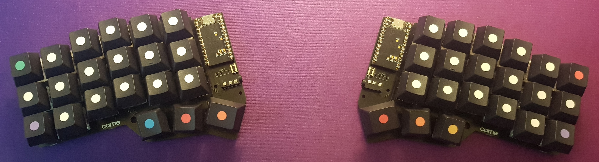

# zmk-config

A custom keymap for the [corne](https://github.com/foostan/crkbd) keyboard.

It is running [ZMK](https://zmk.dev/) which is an open source firmware for wireless keyboards. This config defines the keymap for this software only and is building it with github actions as described in the docs.

